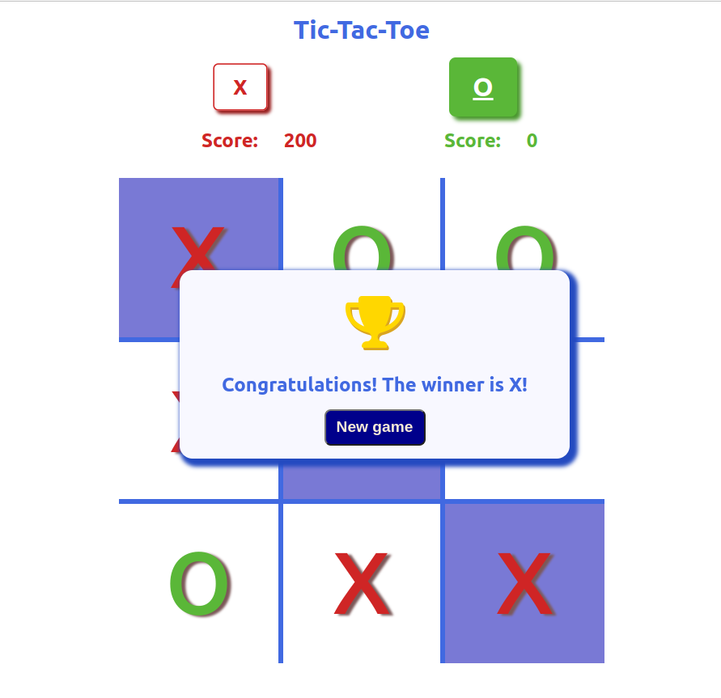

# Project name: Tic-tac-toe

**[Demo link](https://oxanadanilova.github.io/tic-tac-toe-react/)**

---

## Description

This project was created based on [Create React App](https://github.com/facebook/create-react-app).

Tic-tac-toe is a game in which two players take turns in drawing either an 'O' or an 'X' in one square of a grid consisting of nine squares. The winner is the first player to get three of the same symbols in a row. The winner gets 100 points.

---

## How to install this Project

### 1. Install all neccessary npm packages:

`npm run install`

### 2. Run script:

`npm run start`

---

## Technologies

HTML5, SCSS, JavaScript, React, NPM

---

## Contact

Mail: <oxanadanilova11@gmail.com> 
GitHub: [OxanaDanilova](https://github.com/OxanaDanilova) 
LinkedIn: [Oxana Danilova](https://www.linkedin.com/in/oxana-danilova-b082a0156/)

---

Made with ❤️
